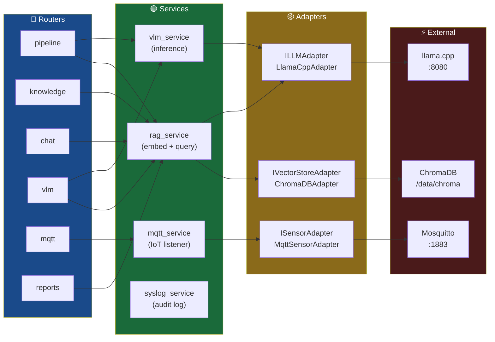

# xCloudVLMui Platform — 核心模組說明（Core Modules）

| 欄位         | 內容         |
|-------------|-------------|
| **文件版本** | v1.1.0       |
| **建立日期** | 2026-04-11   |
| **負責人**   | 系統架構師    |

---

## 目錄

1. [後端模組職責表](#1-後端模組職責表)
2. [資料庫 ER Diagram](#2-資料庫-er-diagram)
3. [跨模組互動矩陣](#3-跨模組互動矩陣)
4. [Service 層呼叫關係](#4-service-層呼叫關係)
5. [Adapter 介面層](#5-adapter-介面層)

---

## 1. 後端模組職責表

### 1.1 Routers（HTTP 接收層）

每個 Router 遵循 **SRP（單一職責原則）**，只負責一個資源域的 HTTP 接收與回應。
業務邏輯委派給對應的 Service。

| 模組檔案 | URL 前綴 | 主要職責 | 依賴 Service | 狀態 |
|---------|---------|---------|-------------|------|
| `routers/equipment.py` | `/api/equipment` | 設備 CRUD（列表/建立/更新/刪除）、設備狀態查詢 | — | ✅ 現行 |
| `routers/vhs.py` | `/api/vhs` | VHS 設備健康分數讀寫、趨勢查詢、設備排名 | — | ✅ 現行 |
| `routers/alerts.py` | `/api/alerts` | 警報查詢、解除、統計（7天趨勢） | — | ✅ 現行 |
| `routers/pipeline.py` | `/api/pipeline` | 批次 VLM 巡檢任務管理、排程執行 | `vlm_service` | ✅ 現行 |
| `routers/knowledge.py` | `/api/knowledge` | 知識文件上傳（PDF/TXT/MD）、管理、向量嵌入 | `rag_service` | ✅ 現行 |
| `routers/chat.py` | `/api/chat` | RAG 問答查詢、對話歷史 | `rag_service` | ✅ 現行 |
| `routers/feature_flags.py` | `/api/settings/feature-flags` | Feature Flag CRUD、toggle、自動植入預設值 | — | ✅ 現行 |
| `routers/vlm.py` | `/api/vlm` | 即時 VLM 推論觸發、截圖分析、結果儲存 | `vlm_service`, `rag_service` | ✅ 現行 |
| `routers/auth.py` | `/api/auth` | NextAuth 回調、使用者 CRUD | — | ✅ 現行 |
| `routers/reports.py` | `/api/reports` | 維修報告 CRUD、Markdown 匯出 | `rag_service` | ✅ 現行 |
| `routers/mqtt.py` | `/api/mqtt` | MQTT 裝置管理、感測器讀值查詢、閾值設定 | `mqtt_service` | ✅ 現行 |
| `routers/settings.py` | `/api/settings` | 系統設定鍵值對讀寫 | — | ✅ 現行 |
| `routers/syslog.py` | `/api/syslog` | 系統日誌查詢、操作紀錄 | `syslog_service` | ✅ 現行 |
| `routers/dashboard.py` | `/api/dashboard` | **Deprecated shim**，委派至新 routers | equipment/vhs/alerts/pipeline | ⚠️ 廢棄（v1.3.0 移除）|
| `routers/rag.py` | `/api/rag` | **Deprecated shim**，委派至 knowledge/chat | knowledge/chat | ⚠️ 廢棄（v1.3.0 移除）|

### 1.2 Services（業務邏輯層）

| 模組檔案 | 主要職責 | 外部依賴 | 關鍵函數 |
|---------|---------|---------|---------|
| `services/rag_service.py` | 文件分塊、向量嵌入、RAG 查詢 + LLM 生成 | ChromaDB, llama.cpp | `rag_query()`, `embed_document()`, `chroma_is_healthy()` |
| `services/mqtt_service.py` | MQTT 訂閱監聽、Payload 解析、閾值比對、警報觸發 | aiomqtt, Mosquitto | `mqtt_listener()`, `_parse_payload()`, `_check_threshold()` |
| `services/syslog_service.py` | 系統日誌寫入、自動清理（90天）、啟停事件記錄 | syslog.db (aiosqlite) | `log_event()`, `purge_old_syslogs()`, `syslog_cleanup_task()` |
| `services/vlm_service.py` | VLM 推論呼叫（llama.cpp multimodal）、圖像預處理 | llama.cpp :8080, RealSense | `analyze_image()`, `capture_frame()` |

### 1.3 Adapters（介面抽象層）

> 位於 `backend/adapters/`，使用 Python `Protocol` 定義介面，隔離第三方依賴

| 介面 | 檔案 | 實作類別 | 用途 |
|------|------|---------|------|
| `ISensorAdapter` | `adapters/base.py` | `MqttSensorAdapter` | 感測器資料來源抽象（未來可換 OPC-UA 等） |
| `ILLMAdapter` | `adapters/base.py` | `LlamaCppAdapter` | LLM 推論抽象（未來可換 Ollama / OpenAI）|
| `IVectorStoreAdapter` | `adapters/base.py` | `ChromaDBAdapter` | 向量資料庫抽象（未來可換 pgvector） |

### 1.4 Middleware

| 模組檔案 | 職責 |
|---------|------|
| `middleware/syslog_middleware.py` | 自動記錄所有 HTTP 請求/回應至 syslog.db（action, method, path, status, duration, user_id, ip） |

### 1.5 設定與基礎設施

| 模組檔案 | 職責 |
|---------|------|
| `config.py` | `Settings` (Pydantic BaseSettings)，從 `.env` 讀取所有設定，使用 `@lru_cache` 單例 |
| `database.py` | SQLAlchemy async engine + `AsyncSession` factory，`Base` declarative，`init_db()` 建表 |
| `database_syslog.py` | 獨立 syslog.db 連線（避免鎖競爭），`init_syslog_db()` 建表 |
| `main.py` | FastAPI app 建立、lifespan（背景任務管理）、middleware 掛載、router 註冊、health check |

---

## 2. 資料庫 ER Diagram

```mermaid
erDiagram
    users {
        string id PK "UUID"
        string name
        string email UK "索引"
        string image
        string provider "google|github"
        string provider_id
        datetime created_at
        datetime last_login_at
    }

    reports {
        string id PK "UUID"
        string user_id FK "→ users.id (nullable)"
        string title
        string equipment_id "索引"
        string equipment_name
        string risk_level "critical|elevated|moderate|low"
        string source "vlm-diagnosis|pdm-inspection|manual"
        json raw_vlm_json
        text markdown_content
        datetime created_at "索引"
        datetime updated_at
        boolean is_deleted "軟刪除"
    }

    rag_documents {
        string id PK "UUID"
        string filename
        string file_type "pdf|txt|md|csv"
        integer file_size
        text description
        integer chunk_count
        boolean embedded "是否已向量嵌入"
        datetime created_at
    }

    system_settings {
        string id PK "UUID"
        string key UK "索引"
        text value
        text description
        datetime updated_at
    }

    feature_flags {
        string id PK "UUID"
        string key UK "索引（例：ff.line_notify）"
        boolean enabled
        integer rollout_pct "0–100"
        text description
        json metadata "額外設定（webhook_url 等）"
        datetime updated_at
        datetime created_at
    }

    mqtt_devices {
        string id PK "UUID"
        string device_id UK "索引（例：AIR-030-01）"
        string name
        string device_type "sensor|gateway|plc"
        string location
        string topic_prefix "xcloud/compressor_01"
        text description
        boolean online
        datetime last_seen
        datetime created_at
    }

    mqtt_sensor_readings {
        string id PK "UUID"
        string device_id FK "→ mqtt_devices.device_id 索引"
        string topic "索引"
        string sensor_type "temperature|vibration|pressure|rpm 索引"
        text raw_payload
        float value
        string unit
        string quality "good|stale|error"
        datetime timestamp "索引"
    }

    vhs_readings {
        string id PK "UUID"
        string equipment_id "索引"
        float score "0.0–100.0"
        string source "vlm|manual|seed"
        text notes
        datetime recorded_at "索引"
        datetime created_at
    }

    equipment_alerts {
        string id PK "UUID"
        string equipment_id "索引"
        string equipment_name
        string level "critical|elevated|moderate|low"
        text message
        boolean resolved "索引"
        datetime resolved_at
        datetime created_at "索引"
    }

    mqtt_alert_thresholds {
        string id PK "UUID"
        string device_id FK "→ mqtt_devices.device_id 索引"
        string sensor_type "temperature|vibration|pressure"
        float min_value "絕對最小值（critical）"
        float max_value "絕對最大值（critical）"
        float warn_min "警告最小值（elevated）"
        float warn_max "警告最大值（elevated）"
        string unit
        boolean enabled
        datetime created_at
        datetime updated_at
    }

    users ||--o{ reports : "建立"
    mqtt_devices ||--o{ mqtt_sensor_readings : "產生"
    mqtt_devices ||--o{ mqtt_alert_thresholds : "設定"
```



### 表格關係說明

| 關係 | 說明 |
|------|------|
| `users` → `reports` | 一個使用者可建立多份報告（nullable，系統自動報告無 user_id） |
| `mqtt_devices` → `mqtt_sensor_readings` | 一個裝置產生多筆感測器時序資料（cascade delete） |
| `mqtt_devices` → `mqtt_alert_thresholds` | 一個裝置可設定多個感測器類型的閾值 |
| `vhs_readings.equipment_id` | 非 FK，設備 ID 為業務欄位（設備資料在 memory/未來 Equipment 表） |
| `equipment_alerts.equipment_id` | 同上，非 FK，設備資訊冗餘儲存 |

### 獨立資料庫：syslog.db

> `syslog.db` 使用獨立連線（`database_syslog.py`），與主 DB 分離，避免鎖競爭

```
syslog_entries
├── id          TEXT PK
├── action      TEXT (login|logout|api_call|system_start|system_stop|cleanup)
├── method      TEXT (GET|POST|PUT|DELETE)
├── path        TEXT
├── status_code INTEGER
├── duration_ms INTEGER
├── user_id     TEXT (nullable)
├── ip_address  TEXT
├── user_agent  TEXT
├── detail      TEXT (額外 JSON)
└── created_at  DATETIME 索引
```

---

## 3. 跨模組互動矩陣

> ✅ 主要呼叫方向 | ⬅️ 反向呼叫 | — 無直接互動

|  | equipment | vhs | alerts | pipeline | knowledge | chat | mqtt | vlm | auth | reports | feature_flags |
|--|-----------|-----|--------|----------|-----------|------|------|-----|------|---------|---------------|
| **rag_service** | — | — | — | ✅ | ✅ | ✅ | — | ✅ | — | ✅ | — |
| **mqtt_service** | — | — | ✅ | — | — | — | ✅ | — | — | — | ✅ |
| **vlm_service** | — | ✅ | ✅ | ✅ | — | — | — | ✅ | — | ✅ | ✅ |
| **syslog_service** | ✅ | ✅ | ✅ | ✅ | ✅ | ✅ | ✅ | ✅ | ✅ | ✅ | — |
| **SyslogMiddleware** | ✅ | ✅ | ✅ | ✅ | ✅ | ✅ | ✅ | ✅ | ✅ | ✅ | ✅ |

**說明：**
- `mqtt_service` 在接收到超閾值感測數據時，呼叫 `alerts` router 的內部方法建立 `EquipmentAlert`
- `vlm_service` 完成推論後，寫入 `vhs_readings`（vhs）、`equipment_alerts`（alerts）、`reports`（reports）
- `rag_service` 被 `knowledge`（嵌入）、`chat`（查詢）、`vlm`（SOP 檢索）、`pipeline`（批次）呼叫
- `SyslogMiddleware` 對所有 HTTP 請求自動記錄，不需 router 主動呼叫

---

## 4. Service 層呼叫關係



---

## 5. Adapter 介面層

### 設計目的

Adapter 層隔離第三方服務，使核心業務邏輯（Service）不直接依賴具體實作。
測試時可替換為 Mock Adapter；未來技術選型改變時只需替換 Adapter。

### ILLMAdapter

```python
class ILLMAdapter(Protocol):
    async def chat_completion(
        self, messages: list[dict], *, model: str, temperature: float, max_tokens: int
    ) -> str: ...

    async def health(self) -> bool: ...
```

**實作：** `LlamaCppAdapter` → 呼叫 `llama.cpp` OpenAI-compatible API（`:8080/v1/chat/completions`）

**未來擴充：** `OllamaAdapter`、`OpenAIAdapter`

### IVectorStoreAdapter

```python
class IVectorStoreAdapter(Protocol):
    def upsert(self, collection: str, documents: list[str],
               embeddings: list[list[float]], metadatas: list[dict], ids: list[str]) -> None: ...

    def query(self, collection: str, query_texts: list[str],
              n_results: int) -> list[dict]: ...

    def delete(self, collection: str, ids: list[str]) -> None: ...

    def is_healthy(self) -> bool: ...
```

**實作：** `ChromaDBAdapter` → 使用 `chromadb.PersistentClient`

**未來擴充：** `PgVectorAdapter`（v2.0.0 PostgreSQL 遷移時）

### ISensorAdapter

```python
class ISensorAdapter(Protocol):
    async def subscribe(self, topic_pattern: str) -> AsyncIterator[SensorMessage]: ...

    async def publish(self, topic: str, payload: dict, qos: int) -> None: ...

    async def is_connected(self) -> bool: ...
```

**實作：** `MqttSensorAdapter` → 使用 `aiomqtt` 連接 Mosquitto

**未來擴充：** `OpcUaAdapter`（OPC-UA 工業協議）

---

*相關文件：[HIGH_LEVEL_ARCH.md](HIGH_LEVEL_ARCH.md) | [../adr/](../adr/) | [../../backend/models/db_models.py](../../backend/models/db_models.py)*
