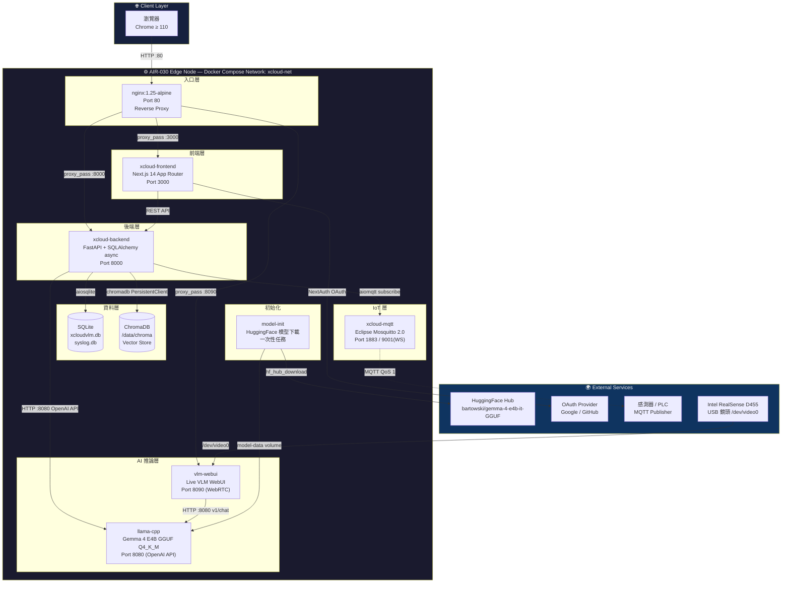
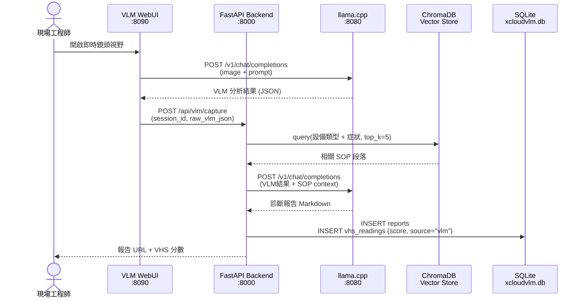
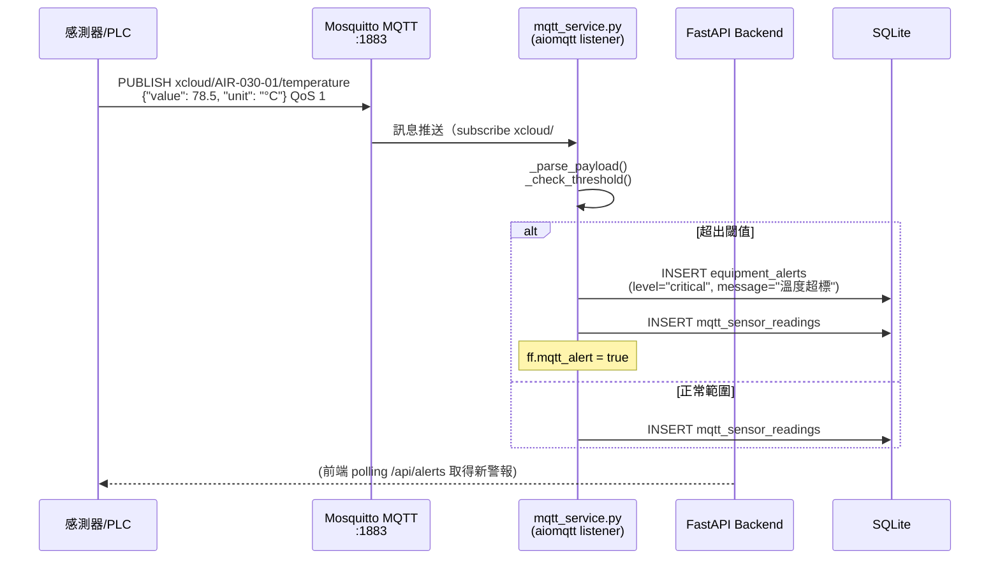
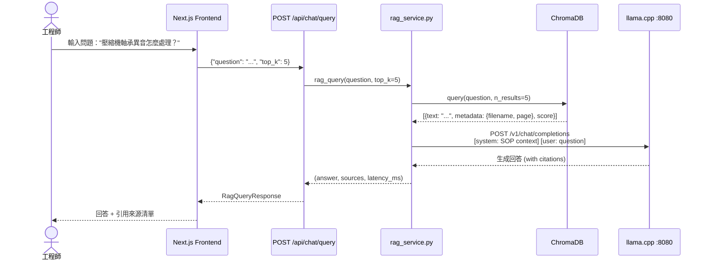

# xCloudVLMui Platform — 高階架構圖（High-Level Architecture）

| 欄位         | 內容         |
|-------------|-------------|
| **文件版本** | v1.1.0       |
| **建立日期** | 2026-04-11   |
| **負責人**   | 系統架構師    |

---

## 1. 系統三層架構總覽

```
┌─────────────────────────────────────────────────────────────────────┐
│                     xCloudVLMui Platform                            │
│               Advantech AIR-030 (Jetson AGX Orin 64GB)              │
├─────────────────────────────────────────────────────────────────────┤
│                                                                     │
│  ┌──────────────── TOP LAYER — 使用者界面層 ───────────────────────┐  │
│  │                                                                 │  │
│  │   瀏覽器 (Chrome ≥ 110)                                         │  │
│  │   ┌─────────────────────────────────────────────────────────┐  │  │
│  │   │         Next.js 14 App Router  (Port 80 via Nginx)      │  │  │
│  │   │  Dashboard │ VLM │ Knowledge │ Alerts │ MQTT │ Reports  │  │  │
│  │   └─────────────────────────────────────────────────────────┘  │  │
│  └─────────────────────────────────────────────────────────────────┘  │
│                              ↕ HTTP/REST                             │
│  ┌──────────────── MIDDLE LAYER — 服務處理層 ──────────────────────┐  │
│  │                                                                 │  │
│  │  ┌──────────────────────────────┐  ┌──────────────────────┐   │  │
│  │  │  FastAPI Backend (Port 8000)  │  │  VLM WebUI (Port 8090)│  │  │
│  │  │  ├─ /api/equipment            │  │  Intel RealSense D455 │  │  │
│  │  │  ├─ /api/vhs                  │  │  WebRTC Live Stream   │  │  │
│  │  │  ├─ /api/alerts               │  └──────────────────────┘  │  │
│  │  │  ├─ /api/pipeline             │                             │  │
│  │  │  ├─ /api/knowledge            │  ┌──────────────────────┐   │  │
│  │  │  ├─ /api/chat                 │  │  llama.cpp (Port 8080)│  │  │
│  │  │  ├─ /api/settings             │  │  Gemma 4 E4B GGUF    │  │  │
│  │  │  └─ /api/health               │  │  Q4_K_M (~4GB VRAM)  │  │  │
│  │  └──────────────────────────────┘  └──────────────────────┘  │  │
│  └─────────────────────────────────────────────────────────────────┘  │
│                                                                     │
│  ┌──────────────── BOTTOM LAYER — 資料持久層 ──────────────────────┐  │
│  │                                                                 │  │
│  │  ┌────────────┐  ┌─────────────┐  ┌──────────────────────┐   │  │
│  │  │  SQLite DB  │  │  ChromaDB   │  │  Mosquitto MQTT      │  │  │
│  │  │  xcloudvlm  │  │  (Vector)   │  │  Port 1883 / 9001    │  │  │
│  │  │  .db        │  │  /data/     │  │  xcloud/#            │  │  │
│  │  │  syslog.db  │  │  chroma     │  └──────────────────────┘  │  │
│  │  └────────────┘  └─────────────┘                             │  │
│  └─────────────────────────────────────────────────────────────────┘  │
│                                                                     │
└─────────────────────────────────────────────────────────────────────┘
```

---

## 2. 服務互動架構圖（Mermaid）



---

## 3. 資料流向圖（Data Flow Diagram）

### 3.1 VLM 設備巡檢流程



### 3.2 MQTT 感測器警報流程



### 3.3 RAG 知識庫問答流程



---

## 4. 部署拓撲圖（Deployment Topology）

```
┌─────────────────────────────────────────────────────────┐
│              AIR-030 實體機                              │
│                                                         │
│  CPU: ARM Cortex-A78AE ×12    GPU: Ampere 2048 CUDA    │
│  RAM: 64GB LPDDR5             eMMC: 64GB               │
│  OS: Ubuntu 22.04 + JetPack 6.0 (CUDA 12.6)           │
│                                                         │
│  ┌───────────────────────────────────────────────────┐ │
│  │        Docker Engine (Rootless)                   │ │
│  │        Network: xcloud-net (bridge)               │ │
│  │                                                   │ │
│  │  ┌──────────┐  ┌──────────┐  ┌──────────────┐   │ │
│  │  │ model-   │  │mosquitto │  │  llama-cpp   │   │ │
│  │  │ init     │  │:1883     │  │  :8080       │   │ │
│  │  │ (one-off)│  │:9001(WS) │  │  GPU: ALL    │   │ │
│  │  └──────────┘  └──────────┘  └──────────────┘   │ │
│  │                                                   │ │
│  │  ┌──────────┐  ┌──────────┐  ┌──────────────┐   │ │
│  │  │ vlm-     │  │ backend  │  │  frontend    │   │ │
│  │  │ webui    │  │ :8000    │  │  :3000       │   │ │
│  │  │ :8090    │  │          │  │              │   │ │
│  │  │ GPU: ALL │  │          │  │              │   │ │
│  │  └──────────┘  └──────────┘  └──────────────┘   │ │
│  │                                                   │ │
│  │  ┌──────────┐                                    │ │
│  │  │  nginx   │    Named Volumes:                  │ │
│  │  │  :80     │    model-data / backend-data       │ │
│  │  │          │    mosquitto-data / mosquitto-log  │ │
│  │  └──────────┘                                    │ │
│  └───────────────────────────────────────────────────┘ │
│                                                         │
│  Physical I/O:                                         │
│  USB: Intel RealSense D455 (/dev/video0)               │
│  ETH: 工廠內網 (LAN) — 感測器 MQTT Publisher           │
│  ETH: 管理網路 — 工程師瀏覽器存取 :80                  │
└─────────────────────────────────────────────────────────┘
```

---

## 5. 外部整合點（External Integration Points）

| 整合點 | 協議 | 方向 | 觸發時機 | 離線可用 |
|--------|------|------|---------|---------|
| HuggingFace Hub | HTTPS | 出站 | 首次部署下載 GGUF | ❌（首次需網路） |
| OAuth Provider (Google/GitHub) | HTTPS/OAuth2 | 雙向 | 使用者登入 | ❌（需外網） |
| LINE Notify（ff.line_notify） | HTTPS Webhook | 出站 | critical 警報觸發 | ❌（需外網） |
| 感測器 / PLC | MQTT :1883 | 入站 | 持續推送感測數據 | ✅（內網） |
| Intel RealSense D455 | USB V4L2 | 入站 | VLM 巡檢時 | ✅（本機） |

---

## 6. 技術棧摘要（Technology Stack）

| 層次 | 技術 | 版本 | 選型依據 |
|------|------|------|---------|
| 推論引擎 | llama.cpp (Tegra) | r36.4 | ADR-002：ARM64 Jetson 唯一成熟方案 |
| LLM 模型 | Gemma 4 E4B GGUF Q4_K_M | 4B | 4GB VRAM，128K context，OpenAI-compatible |
| 後端框架 | FastAPI + uvicorn | 0.111.1 | 非同步高效能，OpenAPI 自動文件 |
| ORM | SQLAlchemy async + aiosqlite | 2.0.30 | 非同步 ACID，輕量邊緣部署 |
| 主資料庫 | SQLite (WAL mode) | 3.x | ADR-001：零基礎設施，備份簡單 |
| 向量資料庫 | ChromaDB PersistentClient | 0.5.3 | ADR-003：Python-native，無額外容器 |
| MQTT Broker | Eclipse Mosquitto | 2.0 | ADR-004：工業 IoT 標準，QoS 1 保障 |
| MQTT Client | aiomqtt | 2.3.0 | 非同步，指數退避重連 |
| 前端框架 | Next.js 14 App Router | 14.2.5 | React Server Components，Edge-ready |
| 認證 | NextAuth v5 | 5.0-beta | OAuth2 + JWT，無狀態 |
| UI 元件 | Tailwind CSS + Radix UI | 3.4.6 | 工業 UI 設計，無障礙支援 |
| 反向代理 | Nginx Alpine | 1.25 | 靜態資源快取，WebSocket proxy |

---

*相關文件：[CORE_MODULES.md](CORE_MODULES.md) | [../adr/](../adr/) | [../../docker-compose.yml](../../docker-compose.yml)*
